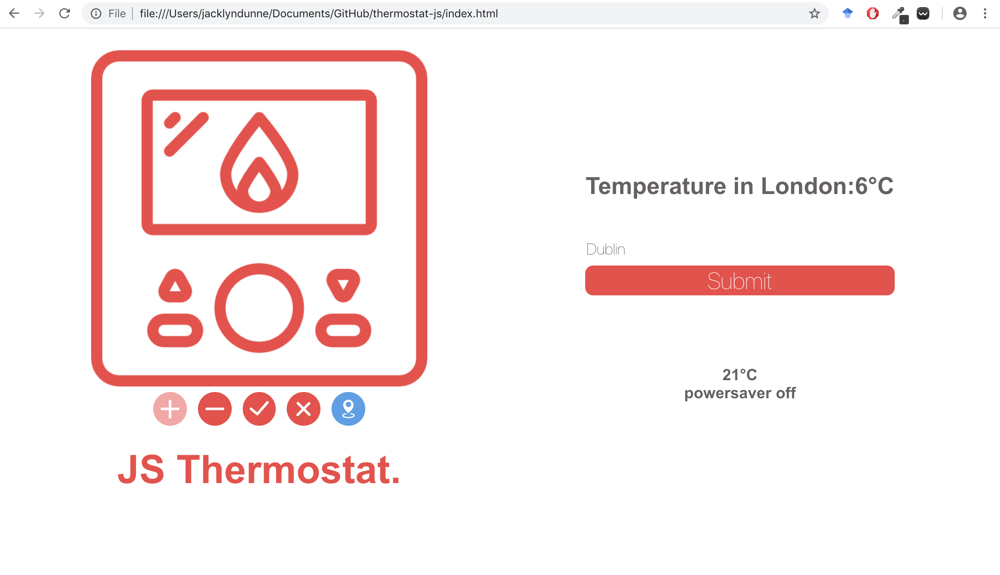

# JS Thermostat
A simple thermostat app made to practice TDD with Javascript and Jasmine. Current version includes thermostat control,
power saver and searchable city temperature. Next steps would include animating the thermostat to make it more interactive,
and adding new pages using Express.



### Setup

```
git clone https://github.com/kiedunne/thermostat-js
cd thermostat-js
```

```
open index.html in any web browser
```

### Testing in Jasmine

```
open SpecRunner.html in any browser
```

### Specification:

* Thermostat starts at 20 degrees
* You can increase the temperature with an up function
* You can decrease the temperature with a down function
* The minimum temperature is 10 degrees
* If power saving mode is on, the maximum temperature is 25 degrees
* If power saving mode is off, the maximum temperature is 32 degrees
* Power saving mode is on by default
* You can reset the temperature to 20 with a reset function
* You can ask about the thermostat's current energy usage: < 18 is `low-usage`, < 25 is `medium-usage`, anything else is `high-usage`.
* Make it so the text for the current tempersture will change colour depending on the energy usuage level: low-usage will be indicated with green, medium-usage indicated with blue, high-usage indicated with red.
* Use Jasmine to Test-Drive Development of a thermostat
